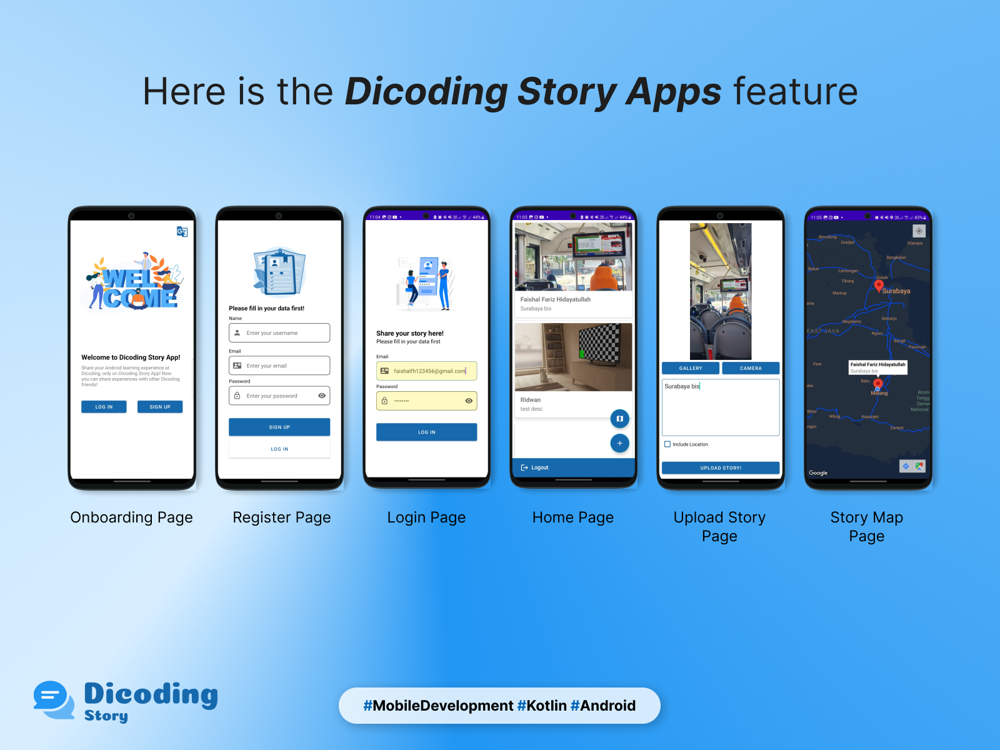

# Dicoding Story Apps

## 📖 About the App

**Dicoding Story Apps** is an Android-based mobile application designed to allow users to share their experiences and stories through photos and descriptions. The app provides an interactive and engaging platform where users can capture moments, upload images, add descriptions, and explore stories shared by others. Additionally, it features a **Story Map**, which helps users visualize the locations from where stories are uploaded, enhancing the storytelling experience.

## 🎯 Goals

The app aims to provide an interactive and user-friendly platform for sharing stories with location-based mapping, making storytelling more immersive and engaging.

## 📲 Features

- **Onboarding Page** – Introduction and guidance for new users.
- **Register Page** – User registration to create an account.
- **Login Page** – Secure authentication to access the app.
- **Home Page** – Displays a feed of stories shared by other users.
- **Upload Story Page** – Users can upload photos, add descriptions, and include location details.
- **Story Map Page** – An interactive map to view the locations of uploaded stories.

## 🛠 Tech Stack

- **Programming Language:** Kotlin
- **Architecture:** MVVM
- **UI Design:** Material Design
- **API Integration:** RESTful API
- **Database:** Firebase / Room Database (if applicable)
- **Location Services:** Google Maps API

## 🚀 Installation

1. Clone this repository:
   ```bash
   git clone https://github.com/faishalfhid/story-apps.git
   ```
2. Open the project in **Android Studio**.
3. Sync the project dependencies.
4. Run the app on an emulator or physical device.

## 📥 Download APK

You can download and install the latest APK from the link below:
[📥 Download Dicoding Story Apps](https://drive.google.com/file/d/1mOVh2A32B6Em0KgK5k6_FWFRRGYwQm6E/view?usp=sharing)

## 📸 Screenshots



Happy coding! 🚀

